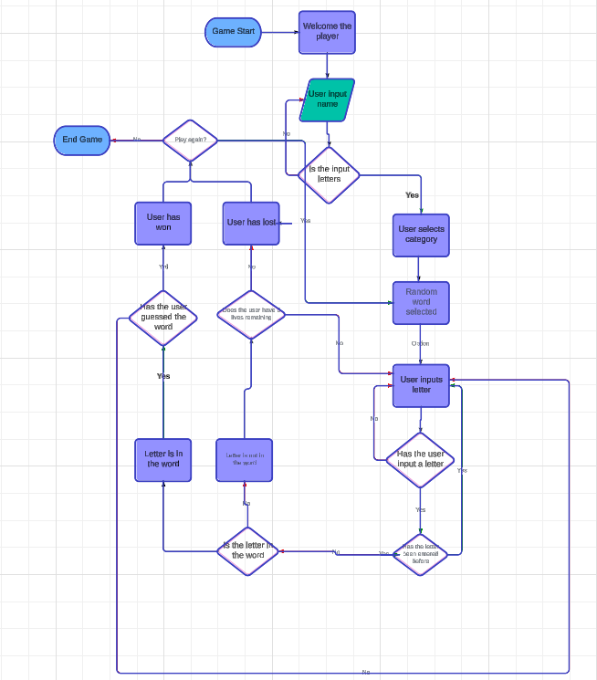

# Godly Hangman

Live site [here](https://godly-hangman-9146412cab40.herokuapp.com/)

## Goals
### Site Owner
As the owner of the site, I wanted a way to demonstrate my Python skills, and Hangman seemed the best way to do so. I used mythology for categories to have three similar ones. These names also avoided dashes, or spaces in the middle, whilst a category such as countries would not do this. 

### User Goals
For a first time user, I wanted a simple way to play Hangman. I wanted it to be clear how to play, as well as give options for which list of Gods to be selected. For a returning user, I wanted them not to have to read the instructions again.

## Planning

In order to buld my game, I first mapped out what I wanted it to look like. First I wanted a way for the user to input their name, and to do so without being able to input letters.

After this, I wanted them to have the option to pick which category they wished to use, Greek, Roman or Viking. This is because these are the best known mytholgies. The game would then play as normal Hangman, with part of the gallows being added to the drawing if the answer was incorrect. At the end, the user has the option to play again, and can change which category they are answering.

## Features
### Start Page

The first page the user sees is the start page. This welcomes them to the game, and asks for their name. It then welcomes them to the game. It does not accept numbers, only letters. 

The user is then taken to the next page, which asks which category they wish to answer questions on. This only accepts 1, 2 or 3. Anything else input results in an error.

